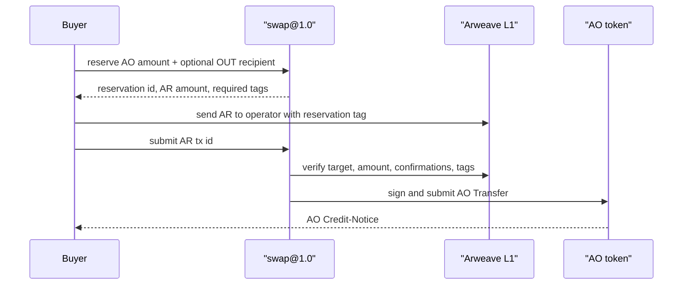

# swap@1.0

Tiny one-sided OTC swap:

```text
buyer sends AR -> node verifies AR L1 -> node pays AO from operator wallet
```

This POC is wallet mode. No orderbook, no matching engine, no escrow contract. Just one pool owned by the node operator.

## Flow



The AR tx must include:

```text
swap-device=swap@1.0
swap-reservation=<reservation-id>
```

## LapEE Model

With LapEE, the operator wallet can be generated inside the LapEE runtime and kept in encrypted memory while the node runs. The operator address is public, but the private key should not exist as a normal hot wallet file outside that runtime.

What this gives:

- Anyone can reserve and pay. No manual operator approval per trade.
- The node only pays AO after it verifies the AR tx on L1.
- Operator cannot selectively change a live trade if the wallet/key and device execution are inside LAPEE.
- The main trust boundary is LapEE runtime + ~swap@1.0 device code + funded AO liquidity

What it does not give:

- Not full smart-contract escrow.
- Operator can still stop running the node.
- If operator wallet has no AO, payout fails.

## Private OUT

The buyer can reserve with an AO `recipient` different from the buyer wallet - with everyting happening in encrypted memory (trade metadata and execution), there will be no explicitly direct BUYER -> OUT-ADDR relationship beside the same trade quantity.

## Test It

Start/restart the node after compile:

```bash
HB_KEY=hyperbeam-key.json HB_PORT=8734 erl -pa _build/default/lib/*/ebin
```

Inside Erlang:

```erlang
application:ensure_all_started(hb).
```

Fresh E2E:

```bash
FRESH=1 \
E2E_STATE=swap-wallet-e2e-state-fresh.json \
OPERATOR_WALLET=hyperbeam-key.json \
BUYER_WALLET=buyer.json \
AVAILABLE_AO=1 \
SWAP_AO_QUANTITY=1 \
PRICE=1 \
PRICE_SCALE=1 \
FEE_BPS=0 \
node scripts/swap-test-e2e.mjs
```

This sends new AR and can pay new AO

## Resume

After AR was sent:

```bash
RESERVATION_ID=<reservation-id> \
AR_TX_ID=<ar-tx-id> \
node scripts/swap-test-e2e.mjs
```

After AO payout was already submitted:

```bash
RESERVATION_ID=<reservation-id> \
AR_TX_ID=<ar-tx-id> \
AO_MESSAGE_ID=<ao-payout-message-id> \
node scripts/swap-test-e2e.mjs
```

If AO slot lookup misses:

```bash
AO_LOOKBACK=5000 \
RESERVATION_ID=<reservation-id> \
AR_TX_ID=<ar-tx-id> \
AO_MESSAGE_ID=<ao-payout-message-id> \
node scripts/swap-test-e2e.mjs
```